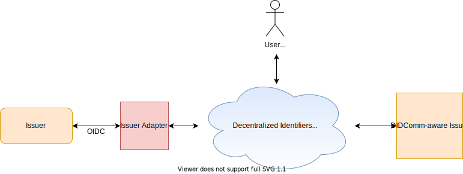

# Issuer Adapter

The Issuer Adapter enables standard REST API flows on top of DIDComm. It exposes REST APIs and 
transparently handles the mechanics of DIDComm on behalf of issuers. Behind the scene, Issuer Adapter 
uses [DIF Wallet And Credential Interaction with DIDComm v2](https://identity.foundation/waci-presentation-exchange/) 
specification to communicate with Wallet.

## Components
- [Issuer Adapter](../../cmd/adapter-rest)

## Integration
- [Issuer](./integration/issuer.md)