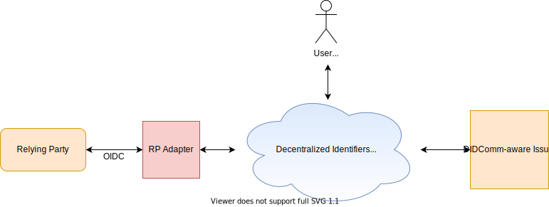

# RP Adapter

The Relying Party (RP) Adapter enables standard OpenID Connect flows on top of DIDComm.

It exposes a standard OpenID Connect provider service and transparently handles the mechanics of DIDComm on behalf of relying parties.

The User's didcomm-aware Wallet is a policy-decision point in the architecture.



## 1 Relying Party Integration
### 1.1 Create Tenant API - HTTP POST /relyingparties

Register a new RP Tenant with the Adapter.

This service will create a new public DID as well as OAuth2 ClientID and ClientSecret credentials for the tenant.

Both the label and the public DID are used in didcomm invitations.

> **Note:** the RP Adapter does NOT store the ClientSecret. Make sure you save the secret returned in the response.

#### Request 
`label`: Required. Should be a human-readable string describing the RP. Will be included in didcomm invitations sent to end user Wallets. <br/>
`callback`: Required. OIDC callback URL. <br/>

```
{
    "label": "Acme University",
    "callback":"http://rp.example.com/oauth2/callback"
}
```

#### Response
`HTTP Status 201 CREATED`
```
{
    "clientID": "75095612-d5c4-44ee-a824-6ec50578b825",
    "clientSecret": "rGDy~Fwf8Hocym8y1q5~da5IV9",
    "publicDID": "did:trustbloc:testnet.trustbloc.local:EiAZRRfUgI9qnsUdYyL9dY40I5JOOJjQURgXFQ5HzYjGeQ"
}
```

### 1.2 OpenID Connect

The RP Adapter exposes a standard [OpenID Connect Discovery endpoint](https://openid.net/specs/openid-connect-discovery-1_0.html).

Users should discover the other OIDC endpoints using the document resource located here.

> **The RP Adapter .**

Current limitations:

* Only supports the authorization code flow
* The `/userinfo` endpoint does not fetch fresh data from the remote Issuer


## 2 Admin / Development

The RP Adapter consists of two key components: [`ory/hydra`](https://github.com/ory/hydra) and a custom login & consent app:


You can read more about Hydra's REST API [here](https://www.ory.sh/hydra/docs/reference/api/).

The custom login & consent app uses [Web Credential Handler](https://github.com/digitalbazaar/web-credential-handler) (CHAPI) to bootstrap DIDComm
communication with the User's Wallet. This app is a thin wrapper over the backend.

### 2.1 CHAPI handlers

The login & consent app backend exposes two endpoints to handle the CHAPI interaction with the user's wallet.

#### 2.1.1 Create CHAPI request - HTTP GET /presentations/create?h={}

Returns the credentials query and the didcomm invitation to the passed to the User's Wallet.

##### Request

`h`: Required. A handle pre-generated by the backend that connects the CHAPI session to an on-going login & consent challenge.

`HTTP GET /presentations/create?h=24222e58-c380-446a-89b8-a21e0a48c6a9`

##### Response

`HTTP Status 200 OK`
```
{
    "pd": {
        "input_descriptors": [
            {
                "id": "banking_input_1",
                "group": ["scope1"],
                "schema": {
                    "uri": "https://bank-standards.com/customer.json",
                    "name": "Bank Account Information",
                    "purpose": "We need your bank and account information."
                }
            }
        ]
    },
    "invitation": {
        "@id": "123456",
        "@type": "https://didcomm.org/didexchange/1.0/invitation",
        "label": "RP's public label",
        "did": "did:trustbloc:testnet.trustbloc.local:1234567"
    }
}
```

#### 2.1.2 Request Validation of Wallet Response - HTTP POST /presentations/handleResponse

Submits a request to validate the credentials provided by the User's Wallet.

This operation is asynchronous. Query the `/presentations/result` endpoint for the result.

##### Request

```jsonc
{
    "invID": "e39eb0b1-ad26-44aa-b00c-534e1196b076",
    "vp": {
        "@context": [
            "https://www.w3.org/2018/credentials/v1",
            "https://trustbloc.github.io/context/vp/presentation-exchange-submission-v1.jsonld"
        ],
        "type": [
          "VerifiablePresentation",
          "PresentationSubmission"
        ],
        "holder": "did:trustbloc:testnet.trustbloc.local:EiCzsakTk3yrv8aZixKt5BjhAfgJIeYQ1XciOcaWeLJTRw",
        "presentation_location": {
          "descriptor_map": [{
              "id": "citizenship_input_1",
              "path": "$.verifiableCredential.[0]"
          }]
        },
        "presentation_submission": {
            "descriptor_map": []
        },
        "proof": {
          "challenge": "7ef2acd6-bd34-415e-91ef-8a167eefc97a",
          "created": "2020-07-15T13:15:40.198-04:00",
          "domain": "example.com",
          "jws": "eyJhbGciOiJFZERTQSIsImI2NCI6ZmFsc2UsImNyaXQiOlsiYjY0Il19..q-V21FjIftMNiE6Frj50tIIOsZRqIItb-F1V03xX7w5YcTTLlZFqmzu0RMv5_77Q7_-bSs7vPo0mAfcYdmiuCg",
          "proofPurpose": "authentication",
          "type": "Ed25519Signature2018",
          "verificationMethod": "did:trustbloc:testnet.trustbloc.local:EiCzsakTk3yrv8aZixKt5BjhAfgJIeYQ1XciOcaWeLJTRw#kBWT2LoutCVdOo6nv1vW"
        },

        "verifiableCredential": [{
            // credentials provided by user (including an AuthorizationCredential, if applicable)
        }]
    }
}
```

##### Response

`HTTP Status 202 Accepted`

#### 2.1.3 Get Validation result for Wallet response - HTTP GET /presentations/result

Returns the result of evaluating the credentials provided by the User's Wallet.

> **TODO**: open issue to return meaningful statuses that the UI can display to the user:
> https://github.com/trustbloc/edge-adapter/issues/109

##### Request

`HTTP GET /presentations/result?h=be6e397d-39b5-4d99-914c-da85726c3590`

##### Response

`HTTP Status 200 OK`
```json
{
    "redirectURL": "https://rp.adapter.example.com/redirect"
}
```

### 2.2 Integration with Hydra

The login & consent app backend exposes two endpoints for integration with Hydra.

#### 2.2.1 Handle Login request - HTTP GET /login

##### Request

`HTTP GET /login?login_challenge=be6e397d-39b5-4d99-914c-da85726c3590`

##### Response

`HTTP Status 302 Found Redirect http://rp.adapter.example.com/oauth2/login/callback`

#### 2.2.2 Handle Consent request - HTTP GET /consent

##### Request

`HTTP GET /consent?consent_challenge=deee87bc-ca55-448f-bafa-d0af94f53e62`

##### Response

`HTTP Status 302 Found Redirect http://rp.adapter.example.com/oauth2/consent/callback`

### 2.3 Health

#### 2.3.1 Liveness/Readiness - HTTP GET /healthcheck

Performs readiness check on the service.

> TODO the implementation is currently too basic and needs to be improved: https://github.com/trustbloc/edge-adapter/issues/134

##### Request

`HTTP GET /healthcheck`

##### Response

`HTTP Status 200 OK`

```json
{
    "status": "success",
    "currentTime": "2020-07-27T23:59:60Z"
}
```
